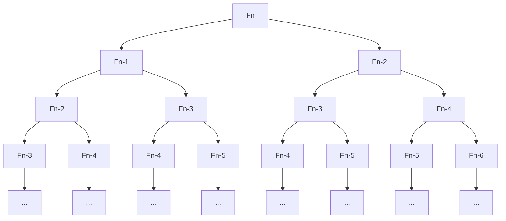
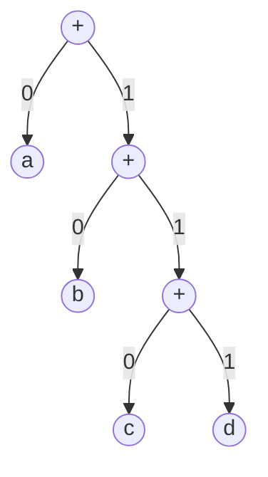

# Конспект лекций по предмету "Алгоритмы и структуры данных"
Лекции взяты с бесплатного онлайн - курса на [Stepik](https://stepik.org/course/217/syllabus), где они выложены в качестве видеоматериала. В данном репозитории представлена сокращённая текстовая адаптация теории курса.

## Ряд Фибоначчи
Формула для вычисления n - го числа Фибоначчи:
$$F_n = \frac {1}{\sqrt5}\left(\left(\frac{1+\sqrt5}{2}\right)^n - \left(\frac{1-\sqrt5}{2}\right)^n\right)$$

>### Задача: вычислить $F_n$
>**Ввод:** целое число $n \geq 0$
>
>**Вывод:** $F_n$

#### Самое неэффективное решение - рекурсивная функция

```
FibRecursive(n)
	если n <= 1:
		вернуть n
	иначе:
		вернуть FibRecursive(n - 1) + FibRecursive(n - 2)
```

#### Время работы 
Через $T(n)$ обозначим число строк кода, выполняемых FibRecursive(n). Тогда:
$$T(n) = 2\space \forall n \leq 1$$

$$T(n) = T(n - 1) + T(n - 2)\space \forall n > 1$$

Следовательно, $T(n) \geq F_n$.
$$T(100) \approx 1.77 * 10^{21}$$

C частотой 1GHz такой алгоритм будет работать несколько десятков тысяч лет.

#### Почему так медленно?

#### Более быстрый алгоритм
```
FibArray(n)
	создать массив F[0..n]
	F[0] <- 0
	F[1] <- 1
	для i от 2 до n:
		F[i] <- F[i - 1] + F[i - 2]
	вернуть F[n]
```
#### Время работы
Выполняет $2n + 2$ строки кода. Соответственно, $T(100) = 202$.

### Примеры решения связанных задач
### Задача: Небольшое число Фибоначчи
>Дано целое число $1 \leq n \leq 40$, необходимо вычислить $n$-е число Фибоначчи (напомним, что $F_0=0$, $F_1=1$ и $F_n=F_{n-1}+F_{n-2}$​ при $n \geq 2$).
>
>**Пример ввода:** 3
>
>**Пример вывода:** 2

#### Решение на Java
```Java
import java.util.*; 

public class Main { 
	public static void main(String[] args) { 
		int[] F = new  int[40]; 
		F[0] = 0; F[1] = 1; 
		
		Scanner in = new Scanner(System.in); 
		int n = in.nextInt(); 
		
		for (int i = 2; i <= n; i++) { 
			F[i] = F[i - 1] + F[i - 2]; 
		} 
		System.out.println(F[n]); 
	} 
}
```

### Задача: Последняя цифра большого числа Фибоначчи
>Дано число  $1 \leq n \leq 10^7$, необходимо найти последнюю цифру $n$-го числа Фибоначчи.
>
>Как мы помним, числа Фибоначчи растут очень быстро, поэтому при их вычислении нужно быть аккуратным с переполнением. В данной задаче, впрочем, этой проблемы можно избежать, поскольку нас интересует только последняя цифра числа Фибоначчи: если  $0 \leq a,b \leq 9$  — последние цифры чисел  $F_i$  и  $F_{i+1}$​  соответственно, то  $(a+b) \bmod{10}$  — последняя цифра числа  $F_{i+2}$.
>
>**Пример ввода:** 841645
>
>**Пример вывода:** 5

#### Решение на Java
```Java
import java.util.*;

public class Main {
	public static void main(String[] args) {
        	List<Long> F = new ArrayList<Long>();
        	F.add(0, (long)0);
		F.add(1, (long)1);

		Scanner in = new Scanner(System.in);
		int n = in.nextInt();

		for (int i = 2; i <= n; i++) {
		    F.add(i, (F.get(i - 1) + F.get(i - 2) % 10));
		}

		System.out.println(F.get(n) % 10);
	}
}
```

## O - нотация

>### Определение: O - нотация
>$\sqsupset f, g: N \to R > 0$ 
>
>Говорим, что $f$ растёт не быстрее $g$ и пишем $f(n) = O(g(n))$ или $f \preceq g$, если существует такая константа $с > 0$, что $f(n) \leq c \cdot g(n)$ для всех $n \in N$.

#### Пример
$3n^2 + 5n + 2 = O(n^2)$, поскольку при $n \geq 1$ выполнено 
$3n^2 + 5n + 2 \leq 3n^2 + 5n^2 + 2n^2 = 10n^2$.

Для оценки времени работы алгоритмов используют О - символику.

#### Преимущества
- Характеризует зависимость времени работы от размера входных данных
- Более простые оценки ($О(n^2)$ вместо $3n^2 + 5n + 2$)
- Упрощённый анализ (не думаем, сколько в действительности занимает каждая отдельная операция)
- Не зависит от машины, на которой запускается алгоритм

#### Недостатки
- О - символика скрывает константные множители, которые на практике могут оказаться очень важными

> ### Определение: $Ω(n)$, $Θ (n)$, $o(n)$
> $\sqsupset f, g: N \to R > 0$
>- $f(n) = Ω(g(n))$ и $f \succeq g$, если существует положительная константа $с$, для которой $f(n) \succeq c \cdot g(n)$ ($f$ растёт не медленнее $g$)
>- $f(n) = Θ(g(n))$ и $f \asymp g$, если $f = O(g)$ и $f = Ω(g)$ ($f$ и $g$ имеют одинаковую скорость роста)
>- $f(n) = o(g(n))$ и $f \prec g$, если $f(n)/g(n) \to 0$ при $n \to \infty$ ($f$ растёт медленнее $g$)

То есть, если пишем $O(g(n))$, то это значит, что наш алгоритм в самом худшем случае будет работать со сложностью $g(n)$. 
Если обозначаем $Ω(g(n))$ - то наоборот.
Если $Θ(g(n))$ - это значит, что при случайной расстановке данных алгоритм будет работать со сложностью $g(n)$.

### Общие правила

- Постоянные множители можно опускать:
	$7n^3 = Θ(n^3)$, $\frac {n^2}{3} = Θ(n^2)$
- Многочлен более высокой степени растёт быстрее:
	$n^a \prec n^b$ при $a < b$
	$n = O(n^2)$, $n^2 = O(n^4)$, $\sqrt{n} = O(n)$
- Эскпонента растёт быстрее многочлена:
	$n^a < b^n (a > 0, b > 1)$
	$n^5 = O(\sqrt{2}^n)$, $n^2 = O(3^n)$, $n^{100} = O(1.1^n)$
- Многочлен растёт быстрее логарифма:
	$(\log n)^a \prec n^b (a, b > 0)$
	$(\log n)^3 = O(\sqrt{n}), n\log n = O(n^2)$
- Медленнее растущие слагаемые можно опускать:
	$f + g = O(\max{(f, g)})$
	$n^2 + n = O(n^2)$, $2^n+n^9 = O(2^n)$
### Часто используемые функции
$\log n < \sqrt{n} < n < n\log n < n^2 < 2^n$

### Время в зависимости от размера входа
| | $n$ | $n\log n$ | $n^2$ | $2^n$
|---|---|---|---|---
| $n = 20$ | 1 сек | 1 сек | 1 сек | 1 сек
| $n = 50$ | 1 сек | 1 сек| 1 сек | 13 дней
| $n = 10^2$ | 1 сек | 1 сек | 1 сек | 4 $\cdot 10^{13}$ лет
| $n = 10^6$ | 1 сек | 1 сек | 17 мин |
| $n = 10^9$ | 1 сек | 30 сек | 30 лет |
| Макс. $n$ для 1 сек | $10^9$ | $10^7$ | $10^{4.5}$ | 30

### Скорость роста на примере алгоритма получения n - го числа Фибоначчи
| Операция	| Время работы
|---|---
| создать массив F[0...n]| $Θ(n)$
| F[0] $\gets$ 0| $Θ(1)$
| F[1] $\gets$ 1| $Θ(1)$
| для i от 2 до n:| цикл, $Θ(n)$ итераций
| F[i] $\gets$ F[i - 1] + F[i - 2]| $Θ(n)$
| вернуть F[n]| $Θ(1)$

Итого:
$Θ(n) + Θ(1) + Θ(1) + Θ(n) \cdot Θ(n) + Θ(1) = Θ(n^2)$

С одной стороны, О - символика позволяет оценить ситуацию в первом приближении, игнорируя ненужные детали. Однако на практике скрываемые константы и низшие степени полиномов могут оказаться очень важными.

## Коды Хаффмана
>### Задача: сжатие данных
>**Ввод:** строка $s$
>
>**Вывод:** бинарный код символов строки $s$, обеспечивающий кратчайшее представление s.
>
>>**Пример:**
>>s = abacabad
>>коды символов: a: 00, b: 01, c: 10, d: 11
>>закодированная строка: 0001001000010011 (16 битов)

### Коды переменной длины
Естественная идея: присвоить более короткие коды более частым символам.
>**Пример:**
>s = abacabad
>коды символов: 0, b: 10, c: 110, d: 111
>закодированная строка: 01001100100111 (14 битов)

Код называется **беспрефиксным**, если никакой код символа не является префиксом другого кода символы. 

### Декодирование на примере

01001100100111
s = abacabad

### Код Хаффмана
>### Задача: Код Хаффмана
>**Ввод:** частоты символов $f1,...,f_n \in N$
>
>**Вывод:** строго двоичное дерево (у каждой вершины либо ноль, либо два сына), листья которого помечены частотами $f1,...,f_n$, минимизирующее 
>$$\displaystyle\sum_{i=1}^{n} f_i\cdot (глубина\space листа\space f_i)$$

### Частоты для внутренних вершин


Частотой (некорневой) вершины мы назовём количество раз, которое вершина будет посещена в процессе кодировки / декодировки.

### Надёжный шаг
- Мы ищем строго двоичное дерево с минимальной суммой пометок в вершинах, в котором листья помечены входными частотами, а внутренние вершины - суммами пометок их детей
- Двумя наименьшими частотами помечены листья на нижнем уровне
- **Надёжный жадный шаг:** выбрать две минимальные частоты $f_i$ и $f_j$, сделать их детьми новой вершины с пометкой $f_i + f_j$, выкинуть частоты $f_i$ и $f_j$, добавить $f_i + f_j$

>**Пример**
>Имеются вершины с частотами: 10, 3, 5, 21. Нужно построить бинарное дерево
>
>Решение:
>
>

#### Очередь с приоритетами
**Insert($p$)** извлекает новый элемент с приоритетом $p$
**ExtractMin()** извлекает из очереди элемент с минимальным приоритетом

#### Алгоритм

```
Huffman(F[1..n])
	для i от 1 до n
		Insert(H, (i, F[i]))
	для k от n+1 до 2n-1:
		(i, F[i]) <- ExtractMin(H)
		(j, F[j]) <- ExtractMin(H)
		создать вершину k с детьми i, j
		F[k] = F[i] + F[j]
		Insert(H, (k, F[k]))
```

#### Время работы
O($n^2$), если очередь с приоритетами реализована на базе массива, O($n\log n$) - если на базе кучи.
